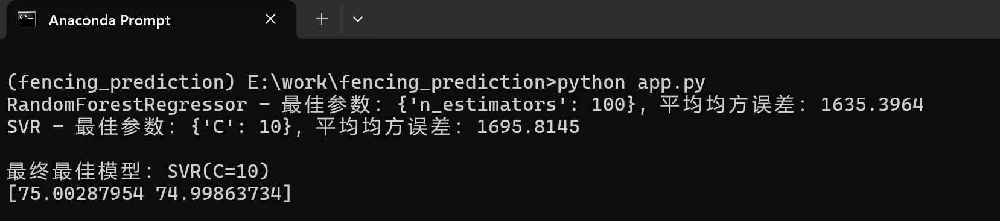

# 项目标题：击剑比赛结果预测

## 项目描述：

本项目旨在利用机器学习模型预测击剑比赛结果。我们使用历史比赛数据，包括选手信息、比赛条件等特征，训练随机森林和支持向量机模型，并通过网格搜索优化超参数。最终，选取性能最佳的模型来预测新比赛的结果。

## 代码说明：

数据加载与预处理：

读取历史比赛数据（CSV 格式）。
筛选特定选手的数据。
对类别特征进行独热编码，数值特征进行标准化。
特征工程：

提取相关特征，包括选手信息、比赛条件等。
将特征和比赛结果分开。
模型训练与优化：

划分训练集和测试集。
定义随机森林和支持向量机模型。
使用网格搜索寻找最佳超参数。
模型预测：

输入新比赛数据（选手信息、比赛条件）。
使用最佳模型进行预测。

## 如何使用：

将您的历史比赛数据保存为 data.csv 文件，确保包含以下列：

参赛选手姓名
比赛日期
比赛地点
比赛级别
剑种
持剑手
选手年龄
选手排名
比赛结果
安装所需的 Python 库：

打开 Anaconda Prompt (或 Terminal/Shell):
Windows 用户：在开始菜单中搜索 "Anaconda Prompt" 并打开。
macOS/Linux 用户：打开终端 (Terminal/Shell) 应用程序。
```markdown
conda create -n fencing_prediction python=3.9
```
```markdown
conda activate fencing_prediction
```
```markdown
pip install pandas scikit-learn
```
### 文件说明：
data.py：构建实例数据文件
```markdown
python data.py
```
data.csv：数据文件
app.py：运行主程序

执行app.py代码，即可获得新比赛的预测结果。
```markdown
python app.py
```


### 所需库：

pandas: 用于数据处理和分析。
scikit-learn: 用于机器学习模型构建、训练和评估。
注意事项：

确保您的 data.csv 文件格式正确，且包含所有必需的列。
您可以根据实际情况调整模型参数和特征选择。
本项目仅为演示目的，预测结果可能不完全准确。
许可证：

## 作者：

[tobinqu@gmail.com]

## 致谢：

本项目参考了 scikit-learn 官方文档。
